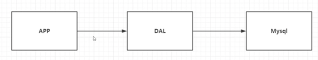
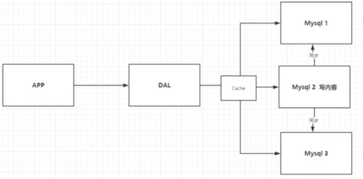
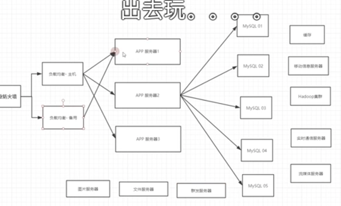
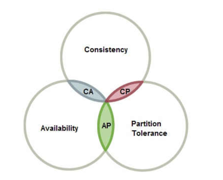

# Nosql

## 为什么要用Nosql

1. 单机MySql年代（90年代） 90年代一个基本的网站访问量不会太大，单个数据库完全足够，更多时候是静态网页html，服务器没有太大压力， 那么网站的瓶颈是什么？
    * 数据量如果太大一个机器放不下
    * 数据索引太大，一个机器内存也放不下
    * 访问刘昂（读写混合），一个服务器承受不了
      

2. Memcached（缓存）+ Mysql + 垂直拆分
    * 网站80%情况都是只读，每次访问数据库的话会十分麻烦，所以我们希望减轻数据的压力，用缓存来保证效率并保证读写分离 发展过程：优化数据结构和索引 -> 文件缓存（IO） -> Memcached
      

3. 分库分表
    * 集群开发，水平拆分，创建Mysql集群
    * 本质上是兼顾数据库读写效率
    * 早年MyLSAM：表锁，十分影响效率，高并发下出现严重的锁问题
    * 转战Innodb：引入行锁

4. 如今年代
    * 技术爆炸，数据爆炸
    * Mysql 等关系型数据库不适用。比如博客中的图片，是的数据库表很大，效率变低
    * Mysql压力变得十分小，大数据IO压力下，表几乎无法变大
      

**回答为什么要用Nosql？ 用户的个人信息，社交网络，地理位置，用户自己产生的数据，用户日志等爆发式增长，这时候就要用到NoSql以处理以上情况

## 什么是NoSql

* NoSQL = Not Only SQL, 泛指非关系型数据库。传统的关系型数据库很难对付web2.0时代，尤其是超大规模的 高并发社区，暴露出很多的问题。Nosql在当今时代发展十分迅速，redis就是其中一个代表

* 很多的数据类型，如用户的个人信息、社交网络、地理位置这些数据类型的存储不需要一个固定的个数，不需要多项操作 就可以横向扩展。Map<String object>

## NoSql特点

1. 方便扩展（数据之间没有关系，很好扩展）
2. 大数量高性能（Redis一秒写8万次，读取11万，NoSql的缓存记录级，是一种细粒度的缓存，性能会比较高）
3. 数据类型是多样型的！（不需要事先设计数据库，随取随用）
4. 传统RDBMS 和 NoSql

* 传统的RDBMS（Relational Database Management System）

- 组织化结构
- Sql
- 数据和关系在独立的表中
- 基础的事务

* NoSql

- 不仅仅是数据
- 没有固定的查询语言
- 键值对存储、列存储、文档存储、图形数据库（社交关系）
- 最终一致性
- CAP定理 和 BASE（异地多活）
- 高性能，高可用，高可扩展

大数据时代的3V：

1. 海量的数据Volume
2. 多样性Variety
3. 实时Velocity

三高：

1. 高并发
2. 高可用（随时水平拆分，机器性能不够可以扩展机器）
3. 高性能（保证用户体验）

> 在一个购物平台中，以下数据类型的存储有不同的数据库
> 1. 商品的基本信息（名称、加个、商家信息）[阿里云的那群疯子](https://www.huxiu.com/article/267100.html)
     > 关系型数据库就可以解决了！Mysql / Oracle，
> 2. 商品的描述、评论（文字居多）
     > 文档型数据库（MongoDB）
> 3. 图片
     > 分布式文件系统 FastDFS

- 淘宝自己的TFS

> - Google的GFS
    > Hadoop
    > 阿里云的 oss
> 4. 商品的关键字

- 搜索引擎： solr、 elasticsearch

> - ISearch： 多隆
>
> 5. 商品热门的波段信息

- 内存数据库

> - Redis Tair Memache
>
> ** 一个网页背后的技术一定不是所想的这么简单

### CAP定理


在理论计算机科学中，CAP定理（CAP theorem），又被称作布鲁尔定理（Brewer's theorem），它指出对于一个分布式计算系统来说，不可能同时满足以下三点：

- 一致性（Consistency） （等同于所有节点访问同一份最新的数据副本）
- 可用性（Availability）（每次请求都能获取到非错的响应——但是不保证获取的数据为最新数据）
- 分区容错性（Partition tolerance）（以实际效果而言，分区相当于对通信的时限要求。系统如果不能在时限内达成数据一致性，就意味着发生了分区的情况，必须就当前操作在C和A之间做出选择[3]。）

## Redis 持久化

两种方式：

1. Redis DataBase(RDB): 持久持久化内存数据到磁盘

    

    * fork一个子进程把数据写到RDB文件

    * 保存内容为二进制数据流

    * 数据恢复更快，但有可能丢失数据

    * 在指定时间间隔内把内存中的数据集快照写入磁盘，也就是行话讲的保存Snapshot快照，它恢复时是将快照文件直接读到内存里

    * Redis会单独创建（fork）一个子进程来进行持久化，会先将数据写到一个临时文件中，待持久化过程结束了，再用这个临时文件替换上次持久化好的文件。整个过程不进行任何IO操作， 保证主进程的性能。如果要进行大规模数据的恢复，且对于数据恢复的完整性不是非常敏感，那RDB方式比AOF更加高效，RDB是默认的持久化方式。

    * 在配置文件中可以设置持久化机制，如60秒修改达到5次触发。但是当60秒内修改次数在5次以内，这段数据将会丢失

      

      > save: 手动触发持久化
      >
      > 触发机制：
      >
      > 1. save命令自动触发
      > 2. flushall命令也会触发rdb规则
      > 3. 退出redis，也会产生rdb文件
      >
      > 恢复： 
      >
      > 1. 只需要将rdb文件放在redis启动目录就可以，redis启动的时候会自动检查dump.rdb恢复数据
      > 2. 查看存在的位置

      

2. AOF（Append only file）： 持久化修改数据

    

    * 本质是一种日志，把所有命令记录下来，恢复的时候把所有文件重新执行一遍

    * 客户端发起修改命令后，redis以每秒每个命令非同步的方式写入aof文件，每一次修改都同步，文件的完整性会更好。保存内容为redis命令

    * 命令多，因此数据恢复较慢 Redis 4.0 后推出了混合持久化， 以RDB全量持久化内存数据并以增量方式持久化修改命令，以RDB和AOF共存方式写入AOF文件

    * 

    * 优点：

      1. 每一次修改都同步，文件更加完整

      2. 每秒同步一次，可能会丢失一秒数据

    * 缺点：

      1. 对于数据文件来说，aof远大于rdb，修复速度比rdb慢
      2. aof效率也比rdb慢，所以redis默认的配置就是rdb持久化

    

## Redis 模式

1. 单机模式: 全局只有一台Redis，吞吐量偏低
2. 主从模式(master-slave)：全局有一台主Redis和多台从Redis，主Redis提供写，从Redis提供读，当主Redis down机 时需要手动选择从Redis提供写服务。因此引入哨兵模式
3. 哨兵模式(Sentinel)：缓存服务中有哨兵监听主从Redis的状态，若主Redis down机，哨兵自动选择一台Redis提供写服务。 但全局只有一台Redis提供写服务，因此引入集群模式
4. 通过多个主从集群提供缓存服务，但具体读写到那里？Redis在集群模式下有16384个hash slot 分别分布在主存上 根据key计算出具体的读写位置。

## 分布式锁

定义：在分布式系统中控制多个进程对共有资源的访问称为分布式锁 性质：

1. 互斥性：同一时刻只有一个客户端可获取锁
2. 安全性：锁的获取和释放是同一个客户端
3. 可用性：高可用的分布式锁系统及避免产生死锁

* 如何加锁：使用set原子方法加锁（SET key value NX EX expire-time）
* 如何解锁：检测是否为当前客户端，是的话则解锁

## 高可用问题：

* 缓存穿透（Cache Penetration）：用户访问**不存在的数据**，由于频繁的缓存替换导致请求穿过缓存直接到数据库上，解决方法：
    1. 使用布隆过滤器判断缓存是否存在
    2. 为请求设置一个值为null的缓存，设置较短的过期时间
       * 如果空值能被缓存起来，这就意味着缓存需要更多的空间存储更多的键，这没有实际意义
       * 即使对空值设置了过期时间，还是会存在缓存层和存储层的数据有一段时间窗口的不一致，这对同步任务会有影响
    
* 缓存击穿（ Hotspot Invalid）：用户访问的热点数据缓存过期失效，而重新建立缓存的时候产生高并发的mysql访问。 解决：
    1. 热点数据缓存永不过期
    2. 分布式锁，保证每一个key只有一个线程访问mysql，缓存失效后只有一个进程更新并写入

* 缓存雪崩：大面积缓存过期或服务器宕机
    1. 使用Redis哨兵或集群架构提高可用性
    2. 采用和缓存击穿一样的方式
    3. 错开数据过期时间点，防止大面积失效

### 布隆过滤器

* 概述：基于概率和哈希表的一种过滤器，由一个很长的二进制向量和一系列随机印射函数构成。布隆过滤器可以用于检索一个元素是否在一个集合中，但不能保证100%正确率，通常正确率随着数据总量增大而降低。这里的100%正确率指的是，假如布隆过滤器显示结果为false，既该数据一定不在数据集中，但若他显示为true，该数据可能在数据集中
* 优点：空间和时间效率超过一般算法
* 缺点：有一定的误判率


* 原理：基于以上例子，对于任何一个元素，可以哈希为三个二进制位，当三个二进制位皆为0，说明该元素在数据集中，否则不在
* 常用场景：
  * 比特币网络
  * 分布式系统（map-reduce）-- Hadoop、search engine


## 主从复制

* 将一台Redis服务器的数据，复制到其他Redis服务器。前者称为主节点（master/leader），后者称为从节点（slave/follower）；数据的复制是单向的，只能由主节点到从节点，master以写为主，slave为读为主
* 作用：
  1. 数据冗余（redundancy）：主从复制实现了数据的热备份，是持久化之外的一种数据冗余方式
  2. 故障恢复：当主节点出现问题时，可以由从节点提供服务，实现快速故障恢复，实际上是一种服务的冗余
  3. 负载均衡：在主从复制基础上配合读写分离，由主节点提供写服务，从节点提供读服务（）
  4. 高可用基石：除了上述作用以外，主从复制是哨兵和集群能够实现的基础，因此主从复制是高可用的基础

在主从架构中，当redis主机发生宕机就会发生服务不可用，因此我们一般会为这台主机设置多个存储器 以防止数据丢失，实现读写分离。

```shell
127.0.0.1:6379> info replication
# Replication
role:master
connected_slaves:0
master_failover_state:no-failover
master_replid:6e24609cb03e47407d4d31fb59a0f881acda9792
master_replid2:0000000000000000000000000000000000000000
master_repl_offset:0
second_repl_offset:-1
repl_backlog_active:0
repl_backlog_size:1048576
repl_backlog_first_byte_offset:0
repl_backlog_histlen:0
127.0.0.1:6379> slave of # 
```

**环境配置**

复制3个配置文件，然后修改对应信息：

* 默认情况下每台Redis服务器都是主节点；一般情况下只用配置从机就好了

1. 端口
2. pid名字
3. log文件名字
4. dump.rdb名字

* 使用slave of命令配置从机，但真实的案例是修改配置文件进行配置，命令修改只是暂时的
* slave of no one 可以把自己变成主机，实现手动替换主机

**特点: ** 

1. 主机可以写，从机不能写，只能读。主机中所有信息和数据都会被从机保存
2. 主机断开连接，从机依然连接到主机，但是不能执行写操作，这个时候如果主机回来了，从机依旧可以获取到主句的写信息
3. 如果用的命令行来配置主从，重启后从机会变回主机。只要变为从机，立马会从主机中获取值

* 全量复制：slave启动成功连接到master后会发送一个sync同步命令，主机执行bgsave RDB，此时可能发生写命令，这时主机会把 写命令也给到从服务器去执行，这称为命令传播
* 增量复制：由于全量复制涉及的量较大，因此引入增量复制 进行主从复制的情景：
  1. 新增节点, 全量复制
  2. 断线重连，增量复制
  3. 主服务器ID变了，全量复制
* 从服务器会维护一段复制偏移量，以记录主从服务器的差别


## 哨兵模式

* 主从架构中一种自动选举主机的模式
* 能够在后台监控主机是否故障，如果故障了根据投票数自动将库转换为主库
* 哨兵模式是一种特殊的模式，首先Redis提供了哨兵命令，他是一个独立的进程，作为进程，它会独立运行。原理是哨兵通过ping主机等待Redis服务器响应从而监控运行的多个Redis实例


* 哨兵的作用有两个
  1. 通过发送命令，让Redis服务器返回监控器其运行状态，包括主从服务器
  2. 当哨兵检测到master宕机，会自动将slave切换成master，然后发布订阅模式和通知其他从服务器，修改配置文件，让它们切换主机

* 单个哨兵有可能会出现问题，因此我们可以用多个哨兵进行监控，各个哨兵之间也会互相监控，形成多哨兵模式
* 假设主服务器宕机，哨兵1先检测到这个结果，系统不会马上failover过程，仅仅是哨兵1主观的认为主服务器不可用，这个现象称为**主观下线**, 当后面的哨兵也检测到主服务器不可用且数量达到一定时，那么哨兵之间会进行一次投票，投票结果由一个哨兵发起，进行failover故障转移，切换成功后通过**订阅模式**让各个哨兵把自己监控的从服务器实现切换主机，这称为**客观下线**

配置步骤：

1. 配置哨兵配置文件sentinel.conf

```shell
# sentinel monitor <server> <host> <port> <vote>
sentinel monitor myredis 127.0.0.1 6379 1 # 1 代表主机挂了，投票的从机
```

2. 启动哨兵redis-sentinal
3. 哨兵检测服务器是否宕机，执行failover

**优点：**

1. 哨兵集群，基于主从复制模式，所有主从配置优点它都有
2. 主从之间可以互相切换，故障可以转移，系统可用性会更好
3. 哨兵模式就是主从模式的升级，自动选择更加健壮

**缺点**：

1. 哨兵的配置很麻烦，选择太多
2. redis难以在线扩容，集群一旦到达上限，扩容很麻烦


## Nosql四大分类

1. KV键值对：
    * 数据无结构化，通常被当做字符串或二进制数据
    * Redis 、 Tair、 memecache
2. 文档型数据库
    * Mongo DB
        * Mongo DB是一个基于分布式文件存储的数据库，C++编写，主要用来处理大量文档
        * Mongo DB是一个介于关系型数据库和菲关系型数据库中的中间产品，是菲关系型数据库中功能最丰富，最像关系型数据库的数据库产品
        * ConthDB
3. 列存储数据库
    * 以列簇式存储，将同一列数据存在一起
    * HBASE
    * 分布式文件系统

4. 图关系数据库
    * 不是存图形，存的是关系，如：朋友圈社交网络
    * e.g. Neo4j, InfoGrid

# Redis

## Redis是什么？

* Redis => Remote dictionary server, 远程字典服务！

> Redis Remote Dictionary Server) is an in-memory data structure
> store, used as a distributed, in-memory key–value database,
> cache and message broker, with optional durability. Redis
> supports different kinds of abstract data structures, such
> as strings, lists, maps, sets, sorted sets, HyperLogLogs,
> bitmaps, streams, and spatial indexes. The project is developed a
> nd maintained by a project core team and as of 2015 is sponsored
> by Redis Labs.[8] It is open-source software released under a BSD 3-clause license.[5]

## Redis 能干嘛

Redis会周期性吧更新的数据写入磁盘或把修改操作写入追加的记录文件，并且在此基础上实现了 master-slave Replication同步

1. 内存存储、持久化，内存是断电既失的，所以说持久化很重要（RBD、AOF）
2. 效率高，可以用于高缓存
3. 发布订阅系统
4. 地图信息分析
5. 计时器、计数器（浏览量）

## 特性

1. 多样的数据类型
2. 持久化
3. 集群
4. 事务

## Redis 单线程

Redis 是很快的，由于Redis是基于内存操作，CPU不是Redis的性能瓶颈，Redis的瓶颈是根据机器的内存和网络带宽，既然可以使用单线程来实现，就使用单线程了 Redis 是C语言写的，官方提供的数据为100000+的QPS

**Redis为什么单线程还那么快**：

1. 误区1：高性能的服务器不一定是多线程的
2. 误区2：多线程不一定比单线程效率高 核心： Redis是将所有数据全部放在内存中的，所以用单线程操作效率就是最高的，多线程中，CPU会进行上下文切换，
   这是极为耗时的操作。对于内存系统，没有上下文切换效率就是最高的，多次读写都在一个CPU上这样的效率就是最高的

## Redis 操作和基本数据类型

**Key**
```aidl
清除当前数据库: flushdb
清除所有数据库: flushall
显示所有key: keys *
设置key: set <key>
获取value: get <key>
判断key是否存在: EXIST <key>
数据移到特定数据库: move <key> <db>
设置过期时间: EXPIRE <key> <time>, e.g. EXPIRE name 10 # 设置name 10秒过期
剩余过期时间(time to live): ttl <key>
查看数据类型：type <key>
```

**String**
* String除了字符串还可以是数字
```apl
追加字符串: APPEND <key> <string>
获取长度: STRLEN <key>
自增1：incr <key>
自增：INCRBY <key> <num>
自减1：decr <key>  
自减：DECRBY <key> <num>  
截取字符串: GETRANGE <key> <start> <end>
替换指定位置开始的字符串: SETRANGE <key> <start> <str>
过期前设值： SETEX <key> <seconds> <value>(set with expire): 
若不存在，设为： setnx <key> <value>(set if not exist)
获取多个值: mset k1 [k2 k3 ... ] 
设置多个值: mget k1 v1 [k2 v2 k3 v3... ]  
msetnx：setnx的multiple版本，原子操作，要么全部成功，要么全部失败
getset: 先获取再设置
```

**list**

* 在Redis中，可以使用list实现stack，queue或者阻塞队列
* List 实际是一个链表，每个node可以从before 和 after插入
```apl
LPUSH: 从头部插入
RPUSH: 从尾部插入
LRANGE: 范围获取
LPOP: 移除头部第一个元素
LINDEX: 根据下标获取元素
LLEN: 获取列表长度
LREM(REMOVE)：LREM <key> <count> <element>：移除列表<count>个<element>
RPOPLPUSH <source> <destination>: 移除列表最后一个元素并插入另一个列表
LSET <ls> <index> <value>: 修改值
```

**Set**

* set中的值是无序不可重复的
* Set的相关命令都是s开头 

```apl
SADD: 添加一个元素
SMEMBERS：打印所有元素
SISMEMBER：判断某个元素在集合里
SCARD: 获取集合元素个数
SRANDMEMBER：获取随机元素
SPOP：随机删除元素

# 集合运算
SDIFF <set1> <set2>: 求差集
SINTER <set1> <set2>: 求交集
SUNION <set1> <set2>: 求并集


**Hash**：

* Map集合，key-map 时候这个值是一个map集合
* 命令由H开头

​```apl
HSET <key> <field> <value> [field value ...]: 设置哈希
HGET: 获取哈希
HDEL <hashmap> <key>：删除字段
HGETALL： 打印hash map所有字段
HLEN: 获取哈希长度
HEXIST：获取指定字段是否存在
HKEYS:获取哈希表所有关键字
HVALS：获取所有值
```

**ZSET**: 有序集合, 储存形式 **zset <key> score v1**

```apl
ZADD: 添加元素
ZRANGEBYSCORE: 按顺序打印
ZREM: 移除元素
```

**Geospatial**: 地理数据

* 朋友定位，附近的人

* 命令：

  

```
# 规则：两极地区无法直接添加，一般会下载城市数据，直接通过Java一次性导入
# 参数：<key> <latitude longtitude name>
```

**Hyperloglog**: 基数

* 什么是基数？
> 集合中不重复的元素。A(1,3,5,7,8,7), B(1,3,5,7,8)，则基数为5，可以接受午茶

* Redis 2.8.9 就更新了Hyperloglog的数据结构
* 基数统计算法
* 优点：占用的内存固定，2^64不同的元素的技术，只需要12kb内存，
* 缺点：存在误差，其原理使用统计方法推算

* > 网页的UV（一个人访问一个网站多次，但是还是算作一个人）
  >
  > 传统的方式，set保存用户的id，然后就可以统计set中的元素数量作为标准判断
  >
  > 这个方式如果保存大量用户id占内存就会较高
  >
  > 

```
127.0.0.1:6379> pfadd a1 1 2 3
(integer) 1
127.0.0.1:6379> pfadd a2 4 5 6
(integer) 1
127.0.0.1:6379> PFMERGE a3 a1 a2
OK
127.0.0.1:6379> PFCOUNT a3
(integer) 6
```

**Bitmap **: 位图

* 位存储，统计用户信息，活跃|不活跃， 登录|未登录

* Bit位图，使用01来存储诗句

```
127.0.0.1:6379> setbit a 0 1
(integer) 0
127.0.0.1:6379> setbit a 1 0
(integer) 0
127.0.0.1:6379> GETBIT a 2
(integer) 0
127.0.0.1:6379> GETBIT a 3
(integer) 0
127.0.0.1:6379> BITCOUNT a
(integer) 1
```

### Redis事务

* Redis单条命令保证原子性，但事务是不保证原子性的

* 同时也没有隔离性

* 事务本质：一组命令的集合，一个事务中所有命令都会被序列化，在事务执行过程中，会按顺序执行！

* 一次性、顺序性、排他性！执行一系列的命令。所有的命令在事务中，并没有直接被执行，只有发起执行命令的时候才会执行！Exec

* redis的事务：

  1. 开启事务(multi)
  2. 命令入队(...)

  2.1. 取消事务(取消事务)

  3. 执行事务(exec)

```
127.0.0.1:6379> multi
OK
127.0.0.1:6379(TX)> set k1 v1
QUEUED
127.0.0.1:6379(TX)> set k2 v2
QUEUED
127.0.0.1:6379(TX)> set k3 v3
QUEUED
127.0.0.1:6379(TX)> exec
1) OK
2) OK
3) OK


# 编译型异常，所有命令不执行
127.0.0.1:6379> multi
OK
127.0.0.1:6379(TX)> a
(error) ERR unknown command `a`, with args beginning with: 
127.0.0.1:6379(TX)> set k2 v3
QUEUED
127.0.0.1:6379(TX)> exec
(error) EXECABORT Transaction discarded because of previous errors.

# 运行时异常，异常报错，其余命令正常执行
127.0.0.1:6379> multi
OK
127.0.0.1:6379(TX)> incr k1
QUEUED
127.0.0.1:6379(TX)>  set k2 v2
QUEUED
127.0.0.1:6379(TX)>  set k3 v3
QUEUED
127.0.0.1:6379(TX)> exec
1) (error) ERR value is not an integer or out of range
2) OK
3) OK
```

* 异常检测回滚：

  > 编译型异常(代码有问题，命令有错)，事务中所有命令都不会被执行
  >
  > 运行时异常(1/0): 如果事务队列中存在语法性，那么执行命令的时候是可以正常执行的，错误命令抛出异常


### Redis实现乐观锁（watch 用法）

* 悲观锁： 很悲观，认为什么时候都会出问题，无论做什么都会加锁
* 乐观锁：程序中更为鲳鱼
  1. 很乐观，认为什么时候都不会出问题，所以不会上锁，更新的时候判断一下，在此期间是否有人修改过这个数据(CAS)
  2. 获取version，
  3. 更新的时候比较version  

```
# 正常执行
127.0.0.1:6379> set money 100
OK
127.0.0.1:6379> set out 0
OK
127.0.0.1:6379> watch money
OK
127.0.0.1:6379> MULTI
OK
127.0.0.1:6379(TX)> DECRBY money 20
QUEUED
127.0.0.1:6379(TX)> INCRBY out 20
QUEUED
127.0.0.1:6379(TX)> exec
1) (integer) 80
2) (integer) 20
127.0.0.1:6379> 

# thread 1：
127.0.0.1:6379> watch money 
OK
127.0.0.1:6379> multi
OK
127.0.0.1:6379(TX)> DECRBY money 10
QUEUED
127.0.0.1:6379(TX)>  incrby out 10
QUEUED
(hold on here and thread 2 runs, then it gets: )
127.0.0.1:6379(TX)> exec
(nil)
127.0.0.1:6379> 

# thread 2: 
127.0.0.1:6379> set money 1000
OK
127.0.0.1:6379> set money 500
OK
127.0.0.1:6379> get money 
"490"
127.0.0.1:6379> set money 800
OK
127.0.0.1:6379> set money 1000
OK
127.0.0.1:6379> 

# solution
127.0.0.1:6379> UNWATCH
OK
127.0.0.1:6379> WATCH money
OK
127.0.0.1:6379> MULTI
OK
127.0.0.1:6379(TX)> DECRBY money 1
QUEUED
127.0.0.1:6379(TX)> exec
1) (integer) 999
127.0.0.1:6379> 
```

### Jedis 连接数据库

1. 导入对应依赖

   ```xml
   <dependencies>
     <!-- https://mvnrepository.com/artifact/redis.clients/jedis -->
     <dependency>
       <groupId>redis.clients</groupId>
       <artifactId>jedis</artifactId>
       <version>3.6.0</version>
     </dependency>
   
     <dependency>
       <groupId>com.alibaba</groupId>
       <artifactId>fastjson</artifactId>
       <version>1.2.73</version>
     </dependency>
   </dependencies>
   ```

2. 编码测试

   * 连接数据库
   * 操作命令
   * 断开连接

### Redis发布订阅

* Redis发布订阅（pub/sub）是一种消息通信模式：发送者（pub）发送消息，订阅者（sub）接收消息

* 

* ```shell
  Subscriber: 
  
  127.0.0.1:6379> SUBSCRIBE kuang
  Reading messages... (press Ctrl-C to quit)
  1) "subscribe"
  2) "kuang"
  3) (integer) 1
  1) "message"
  2) "kuang"
  3) "aaa"
  1) "message"
  2) "kuang"
  3) "helloredis"
  
  Publisher: 
  huhawel@VigodeMacBook-Pro ~ % redis-cli 
  127.0.0.1:6379> PUBLISH kuang aaa
  (integer) 1
  127.0.0.1:6379> PUBLISH kuang hello redis
  (error) ERR wrong number of arguments for 'publish' command
  127.0.0.1:6379> PUBLISH kuang helloredis
  (integer) 1
  127.0.0.1:6379> 
  ```

  

* Redis客户端可以订阅任意数量的频道 

* 

* 原理：通过Subscribe命令订阅某频道后，redis-server里维护了一个字典，字典的键是一个个频道，值是一个链表，链表保存了所有订阅这个channel的客户端。SUBSCRIBE命令的关键就是将客户端添加到给定channel的订阅链表中。PUBLISH就是创建一个字典entry。

* 使用场景：

  1. 实时消息系统
  2. 实时聊天（频道当做聊天室，实时回显给所有人）
  3. 订阅、关注系统
  4. 更复杂的场景通常使用MQ（message queue）

### SpringBoot整合

* SpringBoot操作数据源：spring-data jpa jdbc mongodb redis
* SpringData也是和SpringBoot齐名的项目
* jedis采用直连，多个线程操作的话是不安全的，要避免不安全的，使用jedis pool连接池
* lettuce：采用netty，实例可以再多个线程中进行共享，不存在线程不安全的情况！可以减少线程数据，更像NIO模式

