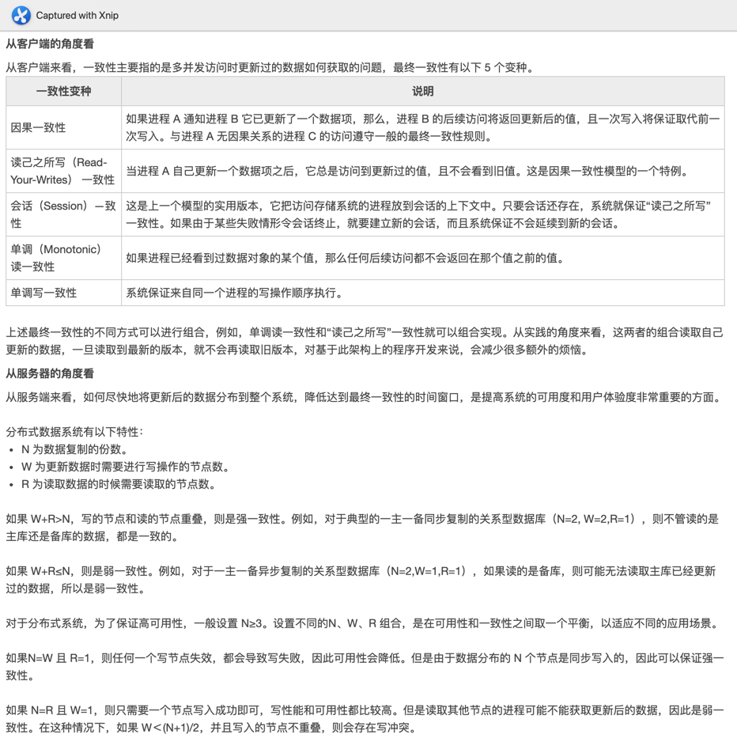

# 分布式系统

## CAP

* C - Consistency
* A - Availability
* P - Partition Tolerance

### 一致性（C）

一致性是指“all nodes see the same data at the same time”，即更新操作成功后，所有节点在同一时间的数据完全一致。

* 一致性可以分为客户端和服务端两个不同的视角：
* 从客户端角度来看，一致性主要指多个用户并发访问时更新的数据如何被其他用户获取的问题；
* 从服务端来看，一致性则是用户进行数据更新时如何将数据复制到整个系统，以保证数据的一致。

一致性是在并发读写时才会出现的问题，因此在理解一致性的问题时，一定要注意结合考虑并发读写的场景。

### 可用性（A）

* 可用性是指“reads and writes always succeed”，即用户访问数据时，系统是否能在正常响应时间返回结果。

* 好的可用性主要是指系统能够很好地为用户服务，不出现用户操作失败或者访问超时等用户体验不好的情况。在通常情况下，可用性与分布式数据冗余、负载均衡等有着很大的关联。

### 分区容错性（P）

* 分区容错性是指“the system continues to operate despite arbitrary message loss or failure of part of the
  system”，即分布式系统在遇到某节点或网络分区故障的时候，仍然能够对外提供满足一致性和可用性的服务。

* 分区容错性和扩展性紧密相关。在分布式应用中，可能因为一些分布式的原因导致系统无法正常运转。分区容错性高指在部分节点故障或出现丢包的情况下，集群系统仍然能提供服务，完成数据的访问。分区容错可视为在系统中采用多副本策略。

## Base

* Base 理论是对CAP理论中一致性（C）和可用性（A）进行权衡的结果。其核心思想是允许操作系统做不到强一致性，但每个应用都可以根据自身特点，以适当方式达到最终一致性

* 基本可用（Basically Availability）：
    - 分布式系统在出现故障时允许系统损失部分可用性，既保证核心功能或当前最重要工能可用
    - 对用户来说，他们当前最关注的功能或常用功能得到保证，但是其他功能会被削弱

* 软状态（Soft-state）
    - 软状态允许系统数据存在中间态，但不影响系统整体可用，允许不同节点的副本之间存在咱叔的不一致

* 最终一致性
    - 最终一致性是BASE的核心，也是Nosql数据库的主要特点，通过弱化一致性，提高系统的可伸缩性、可靠性和可用性。 对于大多数Web应用其实不需要强一致性因此牺牲一致性而换取高可用性是多数分布式数据库产品的方向
    - 最终一致性要求系统中数据副本最终能够一致，而不需要实时保证数据副本一致。例如，银行系统中的非实时转账操作，允许 24 小时内用户账户的状态在转账前后是不一致的，但 24 小时后账户数据必须正确。
  
