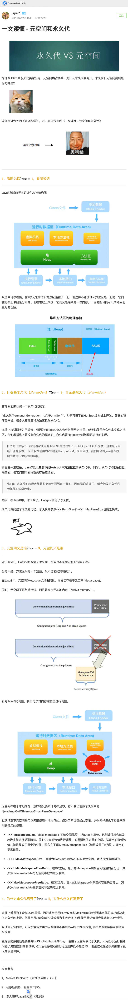
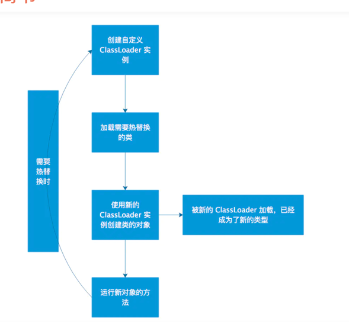

### java对象生命周期

Java的整个生命周期大致可以分为7个

* 创建阶段（Creation）
  > 一个Java类（除Object类外）至少有一个父类（Object），这个规则既是强制的，也是隐式的。你可能已经注意到在创建一个Java类的时候，并没有显式地声明扩展（extends）一个Object父类。
  > 1. 为对象分配存储空间
  > 2. 构造对象
  > 3. 从超类到子类对static成员进行初始化
  > 4. 超类成员按顺序初始化
  > 5. 递归调用超类的构造方法
  > 6. 子类成员变量按顺序初始化

* 应用阶段（Using）
  > * JVM管理着至少一个对这个对象的强引用

* 不可视阶段（Invisible）
  > * 如果一个对象已使用完，而且在其可视区域不再使用，此时应该主动将其设置为空（null）。可以在上面的代码行obj.doSomething();下添加代码行obj = null; ，这样一行代码强制将obj对象置为空值。这样做的意义是，可以帮助JVM及时地发现这个垃圾对象，并且可以及时地回收该对象所占用的系统资源。
  > * 简单来说就是程序本身不再持有对象的强引用，但这些引用依然存在。简单来说就是超出了对象的作用域。
  > * An object is in the “Invisible” state when there are no longer any strong references that are accessible to the program, even though there might still be references.

* 不可达阶段（Unreachable）
  > 1. 对象处于不可达阶段是指该对象不再被任何强引用所持有。
  > 2. 与“不可见阶段”相比，“不可见阶段”是指程序不再持有该对象的任何强引用。对象如果在之前的任何状态被JVM等系统下的某些已装载的静态变量或线程或JNI等强引用持有着，这些特殊的强引用被称为”GC root”。存在着这些GC root会导致对象的内存泄露情况，无法被回收，则对方也无法到达“不可达阶段”。
  > 3. 处于不可到达阶段的对象，在虚拟机所管理的对象引用根集合中再也找不到直接或间接的强引用，这些对象通常是指所有线程栈中的临时变量，所有已装载的类的静态变量或者对本地代码接口（JNI）的引用。这些对象都是要被垃圾回收器回收的预备对象，但此时该对象并不能被垃圾回收器直接回收。其实所有垃圾回收算法所面临的问题是相同的——找出由分配器分配的，但是用户程序不可到达的内存块。

* 可收集阶段（Collectable）
  > 当垃圾回收器发现该对象已经处于"不可达"并且已经对该对象的内存空间重新分配做好准备时，则该对象进入了收集阶段，如果对象重写了finalize方法，此时去执行
* 终结阶段（Finalized）
  > 对象执行完finalize()方法后且被回收前
* 释放阶段（free）

### JVM的构成

#### 元空间(Metaspace)

## 类加载器

### 作用

* 类加载器作用： 将class文件字节码加载到内存中，并将这些静态数据转换成方法区中的运行时数据结构，在堆中生成一个代表这个类 的java.lang.Class对象并作为方法区类数据的访问入口
* 类缓存 标准的Java SE类加载器可以按要求查找类，但一旦某个类被加载到类加载器中，他将维护一段时间，不过JVM垃圾收集器可以回收这些对象

### 分类

**除了引导类加载器由C++编写，其余三个都是由java写的**

* 引导类加载器（bootstrap class loader）
    * 用作加载java的核心库，用原生代码来实现而不继承呢个自java.lang.ClassLoader
    * BootStrap 类加载器负责加载 <JAVA_HOME>/lib 目录中的，或者别-Xbootclasspath 参数指定的路径。并且是被虚拟机识别的，如 rt.jar，名字不符合的类库即使放在 lib 目录中也不会加载。

* 扩展类加载器（extension class loader）
    * 用来加载java的扩展库，jvm的实现会提供一个扩展库目录。类加载器在此目录下查找并加载Java类
    * 扩展类加载器有 sun.misc.Launcher$ExtClassLoader 实现，负责加载 <JAVA_HOME>/lib/ext 目录中的。或者被 java.ext.dirs 系统变量所指定的路径中的所有类库。

* 应用程序类加载器（application class loader）
    * 根据java应用的类路径完成加载.由于这个类加载器是ClassLoader中的getSystemClassLoader()方法的返回值，所以一般也称它为系统类加载器。它负责加载用户类路径（Class
      Path）上所指定的类库，开发者可以直接使用这个类加载器，如果应用程序中没有自定义过自己的类加载器，一般情况下这个就是程序中默认的类加载器。

* 自定义类加载器（custom class loader）
    * 开发人员可以通过继承java.lang.ClassLoader类的方式实现自己的类加载器
      

### 双亲委派模式

当一个类收到了类加载请求，他首先不会尝试自己去加载这个类，而是把这个请求委派给父类去完成，每一个层次类加载器都是如此，因此所有的加载请求都应该传送到启动类加载其中，只有当父类加载器反馈自己无法完成这个请求的时候(
在它的加载路径下没有找到所需加载的Class)，子类加载器才会尝试自己去加载。 采用双亲委派的一个好处是比如加载位于 rt.jar 包中的类
java.lang.Object，不管是哪个加载器加载这个类，最终都是委托给顶层的启动类加载器进行加载，这样就保证了使用不同的类加载器最终得到的都是同样一个 Object 对象。

* 突破双亲委派模式 双亲模式是虚拟机的默认行为，但并非必须这么做，通过重载 ClassLoader 可以修改该行为。事实上，很多框架和软件都修改了，比如 Tomcat，OSGI。具体实现则是通过重写 loadClass
  方法，改变类的加载次序。比如先使用自定义类加载器加载，如果加载不到，则交给双亲加载。

### 热部署

所谓热部署就是在应用正在运行的时候升级软件而不需要重新启动应用

对于JAVA应用程序来说，热部署就是在运行时更时JAVA类文件。在基于java的应用服务器实现热部署的过程中，类加载器扮演着重要的角色。大多数基于JAVA的应用服务器，包括EJB和Servlet容器都支持热部署。类加载器不能重新装入
一个已经加载的类，但只要使用一个新的类，就可以将类再次装入一个正在运行的应用程序

* 热部署的实现和类加载息息相关 不同的ClassLoader加载的同名类属于不同的类型，不能相互转化和兼容。而且JVM
  在默认条件下，同一个类加载器只能加载一个同名类，不再重复加载，如果强行绕过判断则会抛出错误。但是，同一个类加载器不可以加载两个同名类，但不同的类加载器是可以加载同名类的，加载完成后这两个类虽然同名，但不是一个class对象无法进行转换

