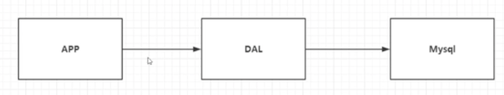
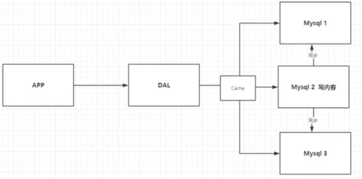
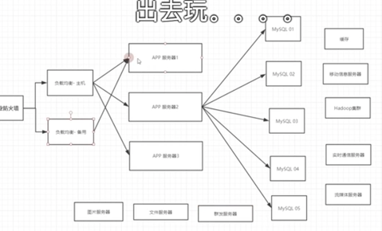
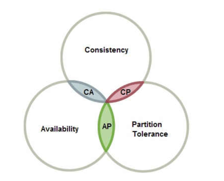

# Nosql

## 为什么要用Nosql

1. 单机MySql年代（90年代） 90年代一个基本的网站访问量不会太大，单个数据库完全足够，更多时候是静态网页html，服务器没有太大压力， 那么网站的瓶颈是什么？
    * 数据量如果太大一个机器放不下
    * 数据索引太大，一个机器内存也放不下
    * 访问刘昂（读写混合），一个服务器承受不了
      

2. Memcached（缓存）+ Mysql + 垂直拆分
    * 网站80%情况都是只读，每次访问数据库的话会十分麻烦，所以我们希望减轻数据的压力，用缓存来保证效率并保证读写分离 发展过程：优化数据结构和索引 -> 文件缓存（IO） -> Memcached
      

3. 分库分表
    * 集群开发，水平拆分，创建Mysql集群
    * 本质上是兼顾数据库读写效率
    * 早年MyLSAM：表锁，十分影响效率，高并发下出现严重的锁问题
    * 转战Innodb：引入行锁

4. 如今年代
    * 技术爆炸，数据爆炸
    * Mysql 等关系型数据库不适用。比如博客中的图片，是的数据库表很大，效率变低
    * Mysql压力变得十分小，大数据IO压力下，表几乎无法变大
      

**回答为什么要用Nosql？ 用户的个人信息，社交网络，地理位置，用户自己产生的数据，用户日志等爆发式增长，这时候就要用到NoSql以处理以上情况

## 什么是NoSql

* NoSQL = Not Only SQL, 泛指非关系型数据库。传统的关系型数据库很难对付web2.0时代，尤其是超大规模的 高并发社区，暴露出很多的问题。Nosql在当今时代发展十分迅速，redis就是其中一个代表

* 很多的数据类型，如用户的个人信息、社交网络、地理位置这些数据类型的存储不需要一个固定的个数，不需要多项操作 就可以横向扩展。Map<String object>

## NoSql特点

1. 方便扩展（数据之间没有关系，很好扩展）
2. 大数量高性能（Redis一秒写8万次，读取11万，NoSql的缓存记录级，是一种细粒度的缓存，性能会比较高）
3. 数据类型是多样型的！（不需要事先设计数据库，随取随用）
4. 传统RDBMS 和 NoSql

* 传统的RDBMS（Relational Database Management System）

- 组织化结构
- Sql
- 数据和关系在独立的表中
- 基础的事务

* NoSql

- 不仅仅是数据
- 没有固定的查询语言
- 键值对存储、列存储、文档存储、图形数据库（社交关系）
- 最终一致性
- CAP定理 和 BASE（异地多活）
- 高性能，高可用，高可扩展

大数据时代的3V：

1. 海量的数据Volume
2. 多样性Variety
3. 实时Velocity

三高：

1. 高并发
2. 高可用（随时水平拆分，机器性能不够可以扩展机器）
3. 高性能（保证用户体验）

> 在一个购物平台中，以下数据类型的存储有不同的数据库
> 1. 商品的基本信息（名称、加个、商家信息）[阿里云的那群疯子](https://www.huxiu.com/article/267100.html)
     > 关系型数据库就可以解决了！Mysql / Oracle，
> 2. 商品的描述、评论（文字居多）
     > 文档型数据库（MongoDB）
> 3. 图片
     > 分布式文件系统 FastDFS
     >

- 淘宝自己的TFS

> - Google的GFS
    > Hadoop
    > 阿里云的 oss
> 4. 商品的关键字
     >

- 搜索引擎： solr、 elasticsearch

> - ISearch： 多隆
>
> 5. 商品热门的波段信息
     >

- 内存数据库

> - Redis Tair Memache
>
> ** 一个网页背后的技术一定不是所想的这么简单

### CAP定理

在理论计算机科学中，CAP定理（CAP theorem），又被称作布鲁尔定理（Brewer's theorem），它指出对于一个分布式计算系统来说，不可能同时满足以下三点：

- 一致性（Consistency） （等同于所有节点访问同一份最新的数据副本）
- 可用性（Availability）（每次请求都能获取到非错的响应——但是不保证获取的数据为最新数据）
- 分区容错性（Partition tolerance）（以实际效果而言，分区相当于对通信的时限要求。系统如果不能在时限内达成数据一致性，就意味着发生了分区的情况，必须就当前操作在C和A之间做出选择[3]。）

## Redis 持久化

两种方式：

1. Redis DataBase(RDB): 持久持久化内存数据到磁盘
    * fork一个子进程把数据写到RDB文件
    * 保存内容为二进制数据流
    * 数据恢复更快，但有可能丢失数据

2. AOF（Append only file）： 持久化修改数据
    * 客户端发起修改命令后，redis以每秒每个命令不同步的方式写入aof文件
    * 保存内容为redis命令
    * 命令多，因此数据恢复较慢 Redis 4.0 后推出了混合持久化， 以RDB全量持久化内存数据并以增量方式持久化修改命令，以RDB和AOF共存方式写入AOF文件

## Redis 模式

1. 单机模式: 全局只有一台Redis，吞吐量偏低
2. 主从模式：全局有一台主Redis和多台从Redis，主Redis提供写，从Redis提供读，当主Redis down机 时需要手动选择从Redis提供写服务。因此引入哨兵模式
3. 哨兵模式：缓存服务中有哨兵监听主从Redis的状态，若主Redis down机，哨兵自动选择一台Redis提供写服务。 但全局只有一台Redis提供写服务，因此引入集群模式
4. 通过多个主从集群提供缓存服务，但具体读写到那里？Redis在集群模式下有16384个hash slot 分别分布在主存上 根据key计算出具体的读写位置。

## 分布式锁

定义：在分布式系统中控制多个进程对共有资源的访问称为分布式锁 性质：

1. 互斥性：同一时刻只有一个客户端可获取锁
2. 安全性：锁的获取和释放是同一个客户端
3. 可用性：高可用的分布式锁系统及避免产生死锁

* 如何加锁：使用set原子方法加锁（SET key value NX EX expire-time）
* 如何解锁：检测是否为当前客户端，是的话则解锁

## 高并发问题：

* 缓存穿透：用户访问不存在的缓存，由于频繁的缓存替换导致请求穿过缓存直接到数据库上 解决：
    1. 使用布隆过滤器判断缓存是否存在
    2. 为请求设置一个值为null的缓存，设置较短的过期时间

* 缓存击穿：用户访问的缓存过期失效，而此时发生高并发造成数据库荷载过大 解决：
    1. 热点数据缓存永不过期
    2. 分布式锁，缓存失效后只有一个进程更新并写入

* 缓存雪崩：大面积缓存击穿或服务不可用
    1. 使用Redis哨兵或集群架构提高可用性
    2. 采用和缓存击穿一样的方式
    3. 错开数据过期时间点，防止大面积失效

## 主从复制

在主从架构中，当redis主机发生宕机就会发生服务不可用，因此我们一般会为这台主机设置多个存储器 以防止数据丢失，实现读写分离。

* 全量复制：从服务器发送sync命令从主机获取数据，主机执行bgsave RDB，此时可能发生写命令，这时主机会把 写命令也给到从服务器去执行，这称为命令传播

* 增量复制：由于全量复制涉及的量较大，因此引入增量复制 进行主从复制的情景：
    1. 新增节点, 全量复制
    2. 断线重连，增量复制
    3. 主服务器ID变了，全量复制

* 从服务器会维护一段复制偏移量，以记录主从服务器的差别

积压缓冲区？？？？

## Nosql四大分类

1. KV键值对：
    * 数据无结构化，通常被当做字符串或二进制数据
    * Redis 、 Tair、 memecache
2. 文档型数据库
    * Mongo DB
        * Mongo DB是一个基于分布式文件存储的数据库，C++编写，主要用来处理大量文档
        * Mongo DB是一个介于关系型数据库和菲关系型数据库中的中间产品，是菲关系型数据库中功能最丰富，最像关系型数据库的数据库产品
        * ConthDB
3. 列存储数据库
    * 以列簇式存储，将同一列数据存在一起
    * HBASE
    * 分布式文件系统

4. 图关系数据库
    * 不是存图形，存的是关系，如：朋友圈社交网络
    * e.g. Neo4j, InfoGrid

# Redis

## Redis是什么？

* Redis => Remote dictionary server, 远程字典服务！

>Redis Remote Dictionary Server) is an in-memory data structure 
>store, used as a distributed, in-memory key–value database, 
>cache and message broker, with optional durability. Redis 
>supports different kinds of abstract data structures, such 
>as strings, lists, maps, sets, sorted sets, HyperLogLogs, 
>bitmaps, streams, and spatial indexes. The project is developed a
>nd maintained by a project core team and as of 2015 is sponsored 
>by Redis Labs.[8] It is open-source software released under a BSD 3-clause license.[5]
> 

## Redis 能干嘛
Redis会周期性吧更新的数据写入磁盘或把修改操作写入追加的记录文件，并且在此基础上实现了
master-slave Replication同步

1. 内存存储、持久化，内存是断电既失的，所以说持久化很重要（RBD、AOF）
2. 效率高，可以用于高缓存
3. 发布订阅系统
4. 地图信息分析
5. 计时器、计数器（浏览量）

## 特性
1. 多样的数据类型
2. 持久化
3. 集群
4. 事务

